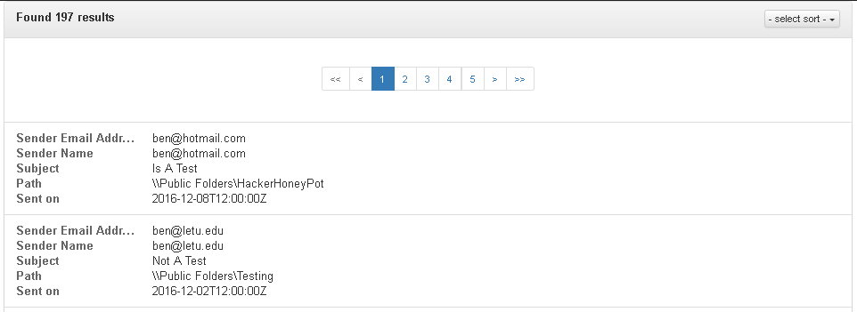

#User Documentation
NOTE: Clicking the "New Search" button will reset all search and sort fields to their default values.

##Search Fields
####General Search

This field searches any part of the message for the contents of the search box. One does not need to use SOLR syntax in this input.

####Sender Email Search

This field uses SOLR syntax (i.e. "corey@let*") for searches on the "sender_email_address_s" field.

####Sender Name Facet List

This facet field displays the facets for the sender email name (sender_name_s). The facet list is searchable through the filter input at the bottom of the input and sortable on first letter (or number).

####Subject Search

This facet field uses SOLR syntax (i.e. "corey@let*") for searches on the "subject_s" field.

####Path Search

This field uses SOLR syntax (i.e. "corey@let*") for searches on the "path_s" field. All SOLR characters that need to be escaped are escaped except for (CHECK IF _ is) *, ?, and ~ as these are used for searching.

####Date Range Search

This input control allows one to search between (and including the first date) the dates on the "sent_on_dt" field. This input defaults to * for the first input (which goes from the beginning of time until the second date) and NOW for the second input (which goes up to the current time). Entering an invalid value into an input will cause the input to go back to its default value. One may type a value into the input--if the input format is valid (i.e. MM/DD/YYYY HH:MM AM (or PM)), then the input may be used. Some formats may also be recognized by the input as the dates are converted by momentjs.

##Sort Fields

These sort parameters allow the user to sort on a few different field options. One can sort on multiple fields as when one option is selected, another box is automatically added to allow a another sort parameter. The order of the fields matters with regard to priority (left to right in priority).

##Results Display
####Result Field

This result section contains the results returned by the current query. One may click a result to view the full contents of the result in a popup dialog (displayed below).

####Email View

This dialog displays the full contents of the email body and some other information about the email. Attachments are also displayed in the Attachment field if any attachments to the result exist. Clicking on an attachment link will perform the default browser action for the given file type.
