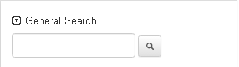
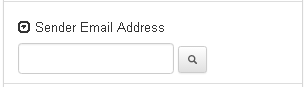
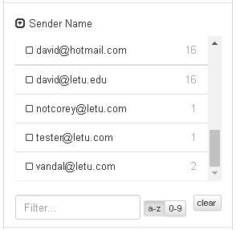
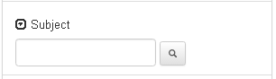
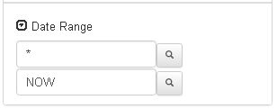
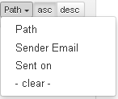

##Search Fields
####General Search

This field searches any part of the message for the contents of the search box. One does not need to use SOLR syntax in this box to search.

####Sender Email Search

This field uses SOLR syntax (i.e. "corey@let*") for searches on the "sender_email_address_s" field.

####Sender Name Facet List

This facet field displays the facets for the sender email name (sender_name_s). The facet list is searchable through the filter input at the bottom of the input and sortable on first letter (or number).

####Subject Search

This facet field uses SOLR syntax (i.e. "corey@let*") for searches on the subject_s field.

####Path Search

This field uses SOLR syntax (i.e. "corey@let*") for searches on the path_s field. All SOLR characters that need to be escaped are escaped except for (CHECK IF _ is) *, ?, and ~ as these are used for searching.

####Date Range Search

This input control allows one to search between (and including the first date) the dates. This input defaults to * for the first input (which goes from the beginning of time until the second date) and NOW for the second input (which goes up to the current time). Entering an invalid value into an input will cause the input to go back to its default value. One may type a value into the input--if the input format is valid (i.e. MM/DD/YYYY HH:MM AM (or PM)), then the input may be used. Some formats may also be recognized by the input as the dates are converted by momentjs.

##Sort Fields

##Results Section
####Result Field

####Email View

